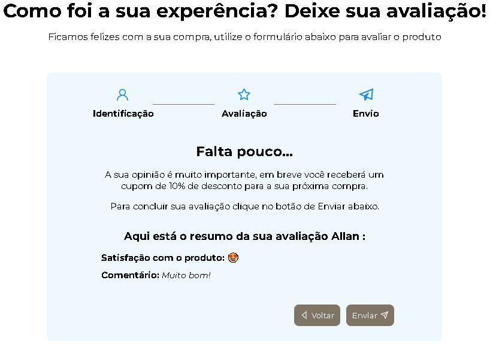

<h1 align="center"> Formulário de avaliação da venda </h1>

Projeto em React, utilizando um modelo de avaliação de atendimento sobre a compra de um produto.  

  <a href="#rocket-tecnologia">Tecnologias</a>&nbsp;&nbsp;&nbsp;|&nbsp;&nbsp;&nbsp;
  <a href="#computer-projeto---acesse-aqui">Projeto</a>&nbsp;&nbsp;&nbsp;|&nbsp;&nbsp;&nbsp;
  <a href="#memo-licença">Licença</a>

 

  

## :rocket: Tecnologia

Esse projeto foi desenvolvido com as seguintes tecnologias:

- React
- JavaScript
- HTML
- CSS

## :computer: Projeto - [Acesse aqui](https://allanpt.github.io/MultiStepForm_react)

Esse projeto tem por conceito aplicar os conhecimentos estudados pela plataforma de ensino Udemy Academy.

## :memo: [Licença](LICENSE)

Esse projeto está sob a licença MIT.
